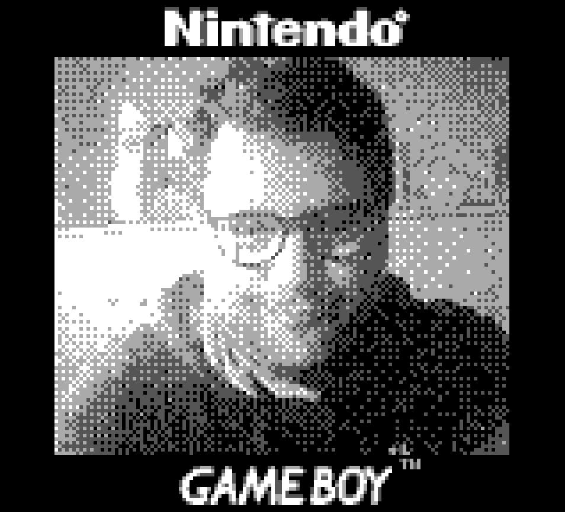
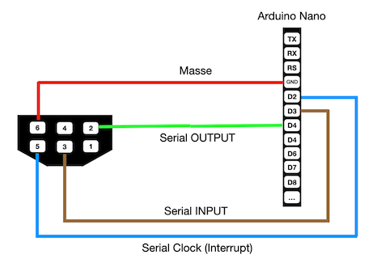
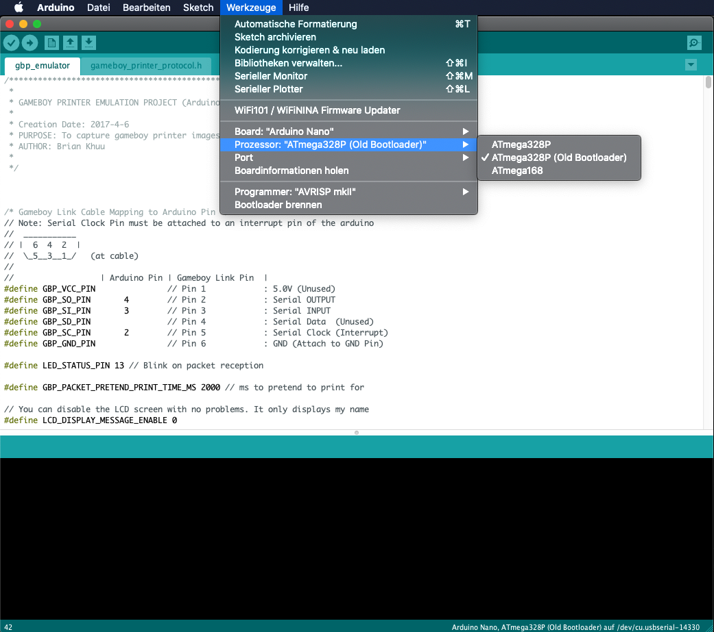
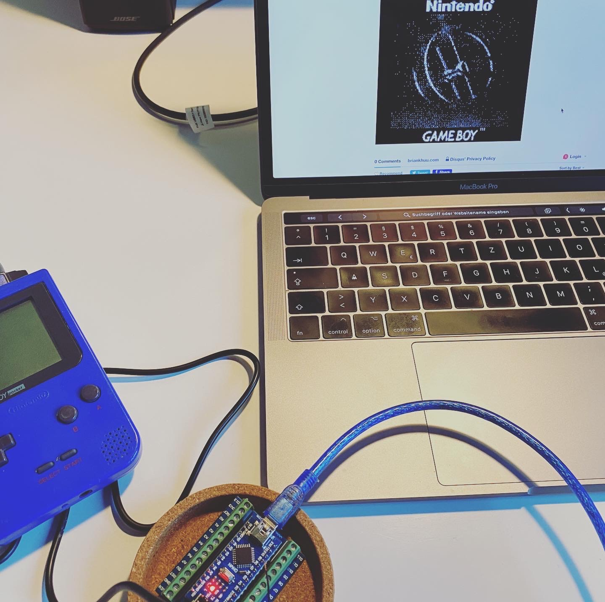
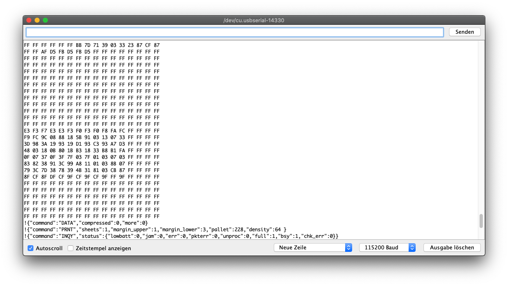
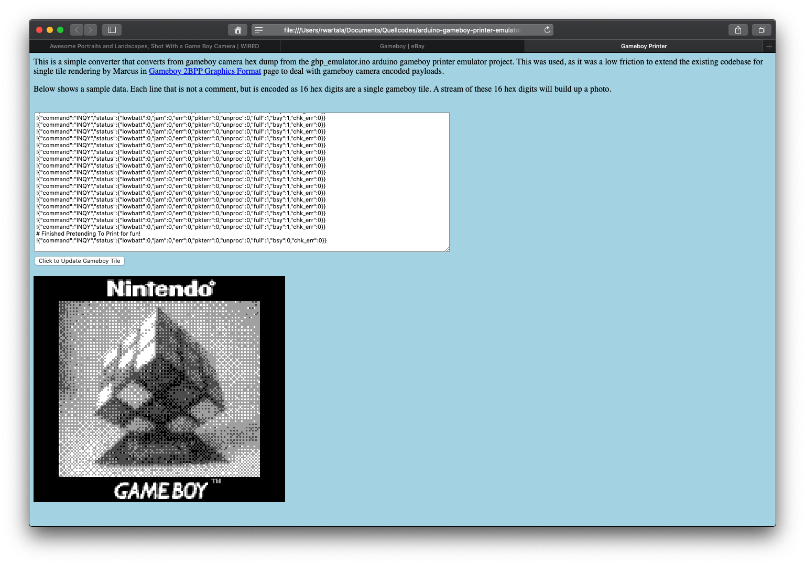
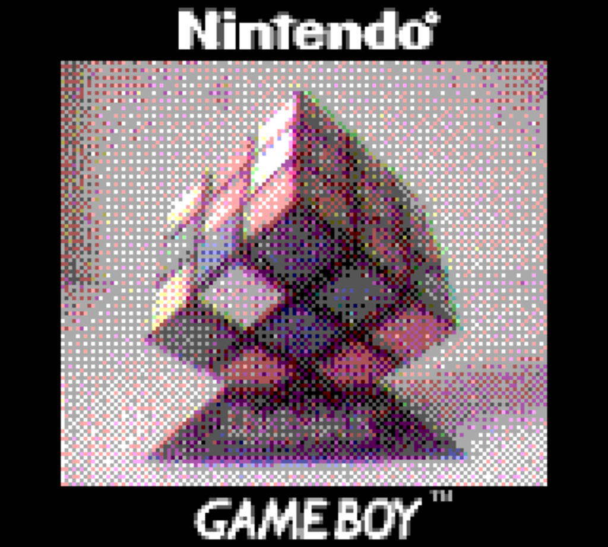

# arduino-gameboy-printer-emulator



## Hintergrund

Nintendos tragbare 8-Bit Konsole [Gameboy](https://de.wikipedia.org/wiki/Game_Boy), kam in Deutschland 1990 heraus. Auch wenn ich zu der Zeit kein Kind mehr war, musste ich diese handliche Spielkonsole sofort haben. Neben Tetris, Super Mario und Zelda hatte es mir besonders das kleine [Kameramodul](https://de.wikipedia.org/wiki/Game_Boy_Camera) angetan, welches man als Zusatzgerät hinten in den Modulschacht einsetzen konnte. Trotz der aus heutiger Sicht unterirdischen Auflösung von 128x112 oder 0,014 Megapixel und der eingeschränkten Speicherfähigkeit von nur 30 Bildern in 4 Graustufen, hatten die Bilder dieser ersten Digitalkamera für Kinder eine eigene Ästhetik, welche auch heute nach über 20 Jahren Hobby- und Profi-Fotografen in ihren ganz eigenen Bann ziehen. Damals konnte man einen kleinen aber passenden [Thermotransferdrucker](https://de.wikipedia.org/wiki/Game_Boy_Printer) von Nintendo als Zubehört mit der Kamerasoftware verbinden und auf einer kleinen Papierrolle die eigenen Bilder ausdrucken. Um heuzutage Gameboy Kamerabilder auf dem heimischen Rechner zu übertragen, ist ein wenig mehr Aufwand und etwas Geschickt nötigt. Die folgende Anleitung und Software ermöglicht diesen Übertragungsweg. 

## Gameboy Printer Emulator
 
Grundlage dieses Projekts ist das GitHub-Repository von [Brian Mofosyne](https://github.com/mofosyne) für den Gameboy Printer Emulator basierend auf einem Arduino Nano. Ich habe es für meine Zwecke an ein oder zwei Stellen geändert um es in meiner Umgebung einfacher nutzen zu können. Mit folgenden Geräten nutze ich diese Installation:

* Gameboy Pocket mit Gameboy Kamera Modul (eBay) ~50 EUR
* Gameboy Link Kabel (eBay) ~7 EUR
* Arduino Nano (iATmega328P CH340G Chip 5V 16MHz inkl. Mini Entwicklerboard mit Terminal Adapter Platine) ~9 EUR

## Link Kabel präparieren

Ich habe das eine Ende des Link Kabels mit Hilfe eines Seitenschneiders abgeschnitten und die einzelnen, bunten Kabel gut 3cm freigelegt. 
Danach habe ich die Isolierung bei dem roten, grünen, blauen und braunen Kabel um gut 5mm entfernt und mit etwas Lötzinn versehen, damit die
feinen Kupferäderchen gut zusammenpappen. Die Kabel habe ich dann nach folgendem Schema mit der Terminal Adapter Platine des Arduino Nano verschraubt.




## Arduino IDE

Als nächtest benötigt man die Integrierte Entwicklungsumgebung für den Arduino. Diebe bekommt man kostenlos direkt bei [arduino.cc](https://www.arduino.cc/en/Main/Software). Danach verbindet man den Arduino Nano über ein USB-Kabel mit dem Rechner.

Nach dem Programmstart lässt sich die Datei ```gbp_emulator.ino```aus dem Verzeichnis ```gbp_emulator``` laden und auf den Arduino Nano übertragen. Wichtig dabei ist die Auswahl des richtigen Boards und der richtigen USB-Schnittstelle.  

 

Danach baut man die Verbindung zum Arduino Nano über den Seriellen Monitor auf und stellt die Baud auf 115200.

## Bilder drucken

Nachdem das Gameboy Kameramodul im Spieleschacht des Gameboy eingerastet ist und das Linkkabel in den dafür vorgesehenen Anschluß gestreckt wurde, kann der Gameboy angeschaltet werden. Danach lässt man sich die gemachten Bilder anzeigen, wählt eins aus und wählt die Funktion ```print``` aus dem obigen Menü aus. Wenn bei der Verkablung alles funktioniert hat, lässt sich in der seriellen Konsole der Arduino IDE mitverfolgen, wie die einzelnen Steuerbefehle und Grauwerte über die USB-Verbindung übertragen werden.  

## Bild speichern

Zum Speichern der Bilder wird ein beliebigiger HTML5-fähiger Webbrowser gestartet und die Datei ```gameboy_printer_js_decoder.html```aus dem Verzeichnis ```jsdecoder``` geöffnet. 

 

Danach kopiert man einfach die Ausageb aus dem Arduino Serial Monitor 

 

und fügt den Inhalt in das HTML-Formular ein. 

 

Wenn alles geklappt hat wird das Bild sichtbar und kann als PNG lokal aus dem Browser heraus, gespeichert werden.

## Bilder in Farbe

Besonders faziniert haben mich die farbigen Gameboy Kamerabilder, welche Matt Gray auf YouTube im Rahmen seines [DIY-Kanals](https://youtu.be/FPkJaEG-C_M) gezeigt hat. 2001 hatte David Friedman auf Ironic Snas (http://www.ironicsans.com/2007/09/idea_color_photos_with_the_gam.html) diese Technik schon beschrieben, welche bereits Anfang 1900 vom russischen Fotografen [Sergei Michailowitsch Prokudin-Gorski](https://de.wikipedia.org/wiki/Sergei_Michailowitsch_Prokudin-Gorski) genutzt wurde. Zu derzeit allerdings noch nicht mit der Gameboy Kamera sondern mit einer Vollformatkamera und [farbigen Linsen](https://www.wired.com/2014/03/prokudin-gorskii-photos-russia/). 

Gray und Friedman nutzen im Gegensatz dazu farbige Folien um das gleiche Bild mit unterschiedlichen Farben aufzunehmen. Ich habe für diesen Zweck einfach [Blitzlicht-Folien](https://www.amazon.de/gp/product/B07S46HM9L/) von Amazon verwendet. Am bestern man nutzt für diese Art Aufnahmen ein Kamerastativ und ein entsprechenden Stativadapter mit dem der Gameboy stabil fixiert werden kann ohne viel zu wackeln. Ich nutze dafür einen einfachen [Smartphone-Adapter](https://www.amazon.de/gp/product/B01N193MHD/r) von Amazon. Jetzt nimmt man dreimal das gleiche Bild auf. Immer mit einer anderen Farbfolie. Am besten man merkt sich auch die Farbe und Reihenfolge. Ich verwende immer zuerst die rote (R), dann die grüne (G) und dann die blaue (B) Folie. Sind die Bilder auf dem Mac lassen sich diese mit gängigen Fotoprogrammen wieder zu einem Bild kombinieren. Das geht auch über die Kommandozeile zum Beispiel mit [Imagemagick](https://imagemagick.org). Dieses läss sich zum Beispiel mit ```brew``` auf dem Mac mit

<pre>
$ brew install imagemagick
</pre>

installieren. Danach reicht ein

<pre>
$ convert mein-bild-R.png mein-bild-G.png mein-bild-B.png -background black -channel RGB -combine mein-bild-RGB.png
</pre>

um aus den drei gefilterten Bilder ein Farbbild zu erzeugen. Das Ergebnis davon kann dann zum Beispiel so aussehen:   



## Quellen

<ul>
<li>[Featured On Hack A Day Article](https://hackaday.com/2017/12/01/arduino-saves-gameboy-camera/)</li>
<li>[Was used by ekeler for a gameboy camera canon EF mount](http://ekeler.com/game-boy-camera-canon-ef-mount/)</li>
<li>[WestM's Arduino Gameboy Printer Emulator Tutorial](https://westm.co.uk/arduino-game-boy-printer-emulator/)</li>
<li>[Max Piantoni : A native Mac App for decoding and saving GameBoy Camera photos via this arduino gameboy printer emulator](https://www.maxpiantoni.com/projects/gbcamstudio/)</li>
<li>[Transferring Game Boy PocketCamera photos to a PC (Youtube Channel Re.Enthused)](https://www.youtube.com/watch?v=KttoycleK8c)</li>
<li>[Blog Post](http://briankhuu.com/projects/gameboy_camera_arduino/gameboy_camera_arduino.html)</li>

